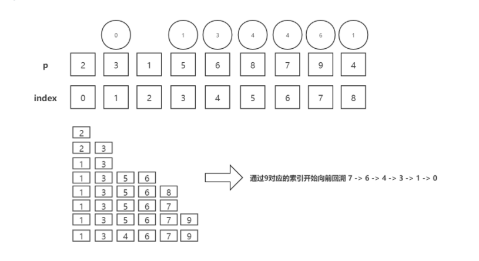

## 获取最长递增子序列个数
- 题：[2,3,1,5,6,8,7,9,4] -> 2 3 5 6 7 9
- 解：
- 2
- 2 3
- 1 3
- 1 3 5 
- 1 3 5 6
- 1 3 5 6 8
- 1 3 5 6 7
- 1 3 5 6 7 9
- 1 3 4 6 7 9 
  
**替换时会导致结果出现错误，但是每次向递增子序列推送元素时，他的上一个元素一定是正确的，需要通过数组进行保存，方便回溯，最后一个值也是正确的。**

```js
function getSequence1(arr) {
    const len = arr.length;
    const result = [0]; // 保存最长递增子序列的索引
    const p = arr.slice(); // p 用来追溯的数组 存储正确递增子序列索引值
    let resultLastIndex;
    let start;
    let end;
    let middle = 0;
    for (let i = 0; i < len; i++) {
        const arrI = arr[i]; // 获取数组中的每一项，但是0 没有意义我们需要忽略掉
        if (arrI !== 0) {
            resultLastIndex = result[result.length - 1];
            if (arr[resultLastIndex] < arrI) {
                p[i] = resultLastIndex // 每次推送时保存上一次正确的索引值
                result.push(i); // 记录索引
                continue
            }
            start = 0;
            end = result.length - 1; // 二分查找 前后索引
            while (start < end) { // 最终start = end 
                middle = ((start + end) / 2) | 0;
                // 拿result中间值合  最后一项比较
                if (arr[result[middle]] < arrI) { // 找比arrI大的值 或者等于arrI
                    start = middle + 1;
                } else {
                    end = middle;
                }
            }
            if (arrI < arr[result[start]]) {
                if (start > 0) {
                    p[i] = result[start - 1]; // 替换时 需要将被替换的位置的正确索引值保存
                }
                result[start] = i; // 用更有潜力的来替换
            }
        }

    }
    let len = result.length
    let last = result[len - 1]
    while (start-- > 0) { // 倒序追溯
        result[start] = last
        last = p[last]
    }
    return result
}
// 针对默认递增的序列进行优化
console.log(getSequence1([1, 5, 8, 2]), 'my') //  [0,3,2] 
```